# Filament Navigator

<p align="center" class="filament-hidden">
    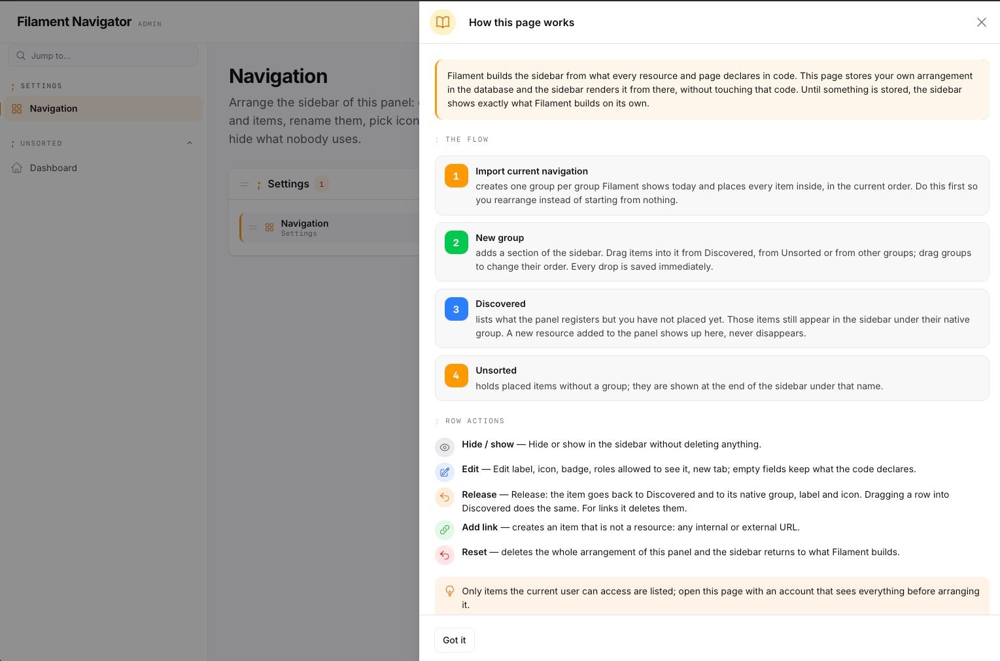
</p>

Official documentation for Filament Navigator: the navigation of a
[Filament](https://filamentphp.com) 5.x panel, run from the panel itself.
Whoever administers the application rearranges the menu, renames it, adds
links to anything — internal pages, external tools, documentation — and
gives every entry its own symbol: a text marker, any Blade icon, **pasted
SVG or an uploaded PNG, JPG, WebP, GIF or AVIF**, not just the icon set the
developer installed. No code, no deploy, no view override: the change is
live in the sidebar the moment it is saved.

Underneath, the sidebar (and optionally the topbar) is rendered by the
plugin's own Livewire components from a per-panel configuration stored in
the database, so the panel also stops looking like stock Filament.

[](https://filamentphp.com)
[](https://laravel.com)
[](https://www.php.net)
[](https://github.com/komma-softhouse/filament-navigator-docs/blob/main/LICENSE.md)

## What this plugin does

- **A menu edited at runtime, not in code.** Groups, order, labels,
  visibility and role restrictions are rows in the database, arranged on a
  settings page with drag and drop — between groups, out of them, back to
  where the code put them. Every save refreshes the sidebar on the spot.
- **Links to anywhere.** *Add link* puts any URL in the sidebar — a path of
  the application, an external tool, a help centre — with its own label,
  symbol, group, badge, role restriction and "open in a new tab". A
  registered page or resource can also have its URL overridden.
- **Any symbol, not only an icon set.** Every group and item takes a text
  marker (`;`, `→`, `$`, `//`), a Blade icon name from whatever icon
  packages the application has, **pasted SVG markup** or an **uploaded
  image** (PNG, JPG, WebP, GIF, AVIF or an SVG file) — the logo of the tool
  a link opens, a brand's own pictogram, a drawing exported from Figma.
  Chosen in a selector with a live preview of the row.
- **SVG made safe.** Pasted markup is sanitised before it is stored and
  again before it is rendered: scripts, event handlers, foreign objects and
  external references are removed, it is sized by CSS, and it follows the
  text colour (active state included) unless the drawing brings its own
  colours.
- **Rename and re-icon what the code declares.** Label, symbol, URL and
  badge of a registered page or resource can be overridden from the page;
  an empty field keeps what the class declares, and *Release* gives the
  item back to the code.
- **Live badges.** Named resolvers registered on the plugin; an item is
  given one from a select. Resolved once per request.
- **Replaces the sidebar, and optionally the topbar**, with its own
  Livewire components: brand block with tagline, type-to-filter box,
  monospace group markers. Every render hook of the stock sidebar and
  topbar is honoured in the same position.
- **Nothing disappears.** Items the panel registers but the configuration
  has not placed stay visible under their native group. Rows whose page or
  resource is gone are skipped, not shown broken.
- **Filament decides who sees what.** The plugin rearranges the navigation
  Filament already composed for the current user, so `canAccess()`,
  `shouldRegisterNavigation()` and cluster rules keep working. Role
  restrictions in the plugin are an extra layer on top.
- **Per panel.** One configuration per panel id; the plugin can be
  registered on several panels of the same application.
- **Themeable.** Every colour, size and font is a `--kn-*` custom property
  with a neutral fallback, in light and dark mode.
- **Explains itself.** A *How it works* slide-over on the settings page
  walks through the flow and opens by itself on a panel with no
  configuration yet.

## Screenshots

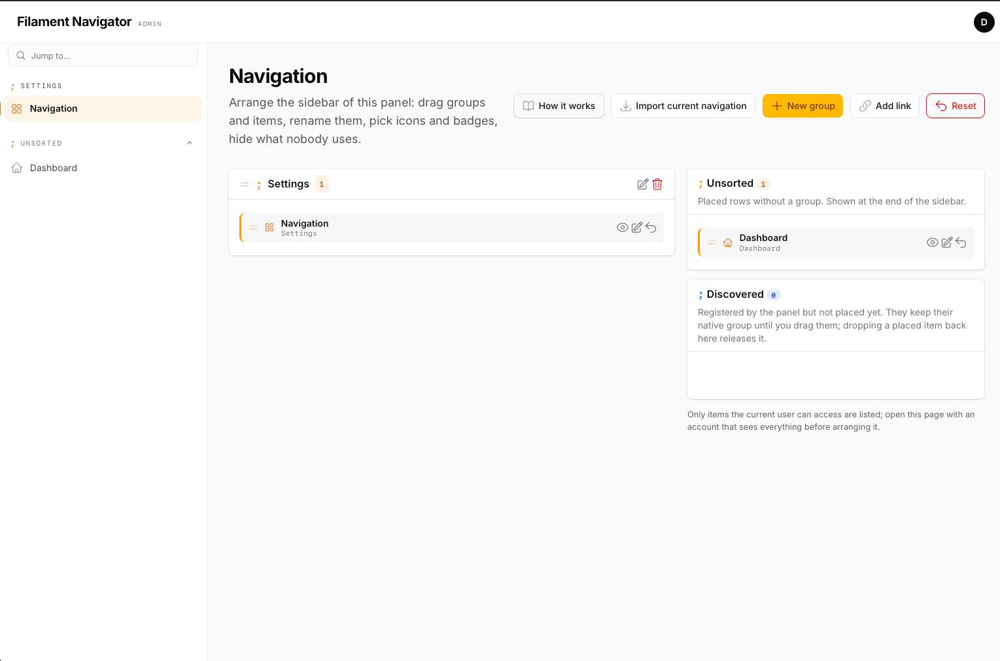

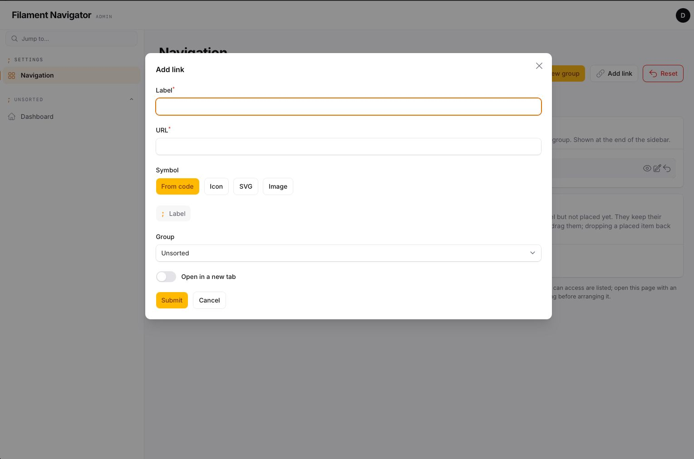

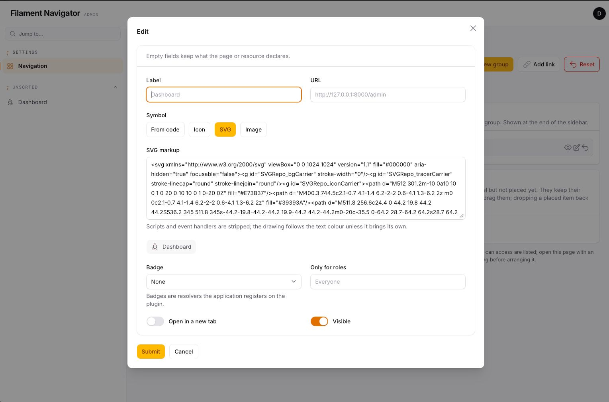

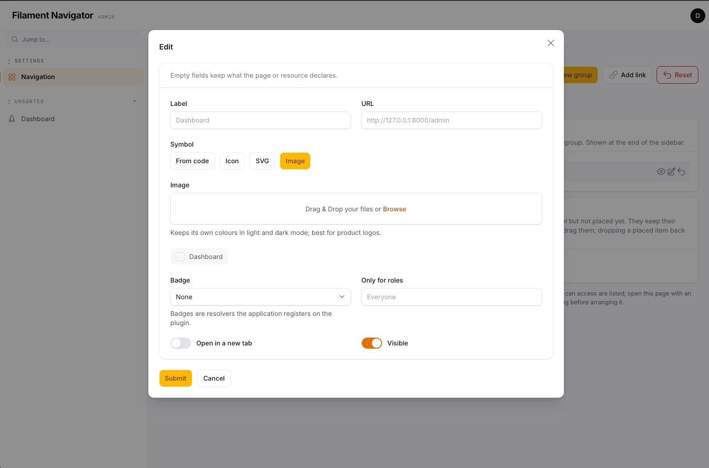


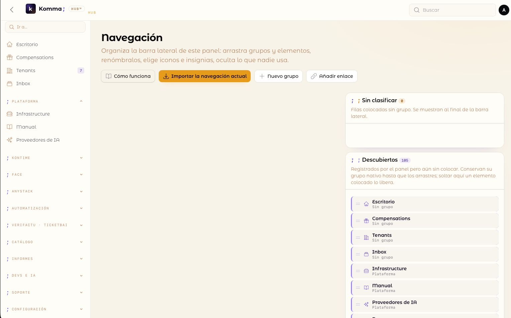

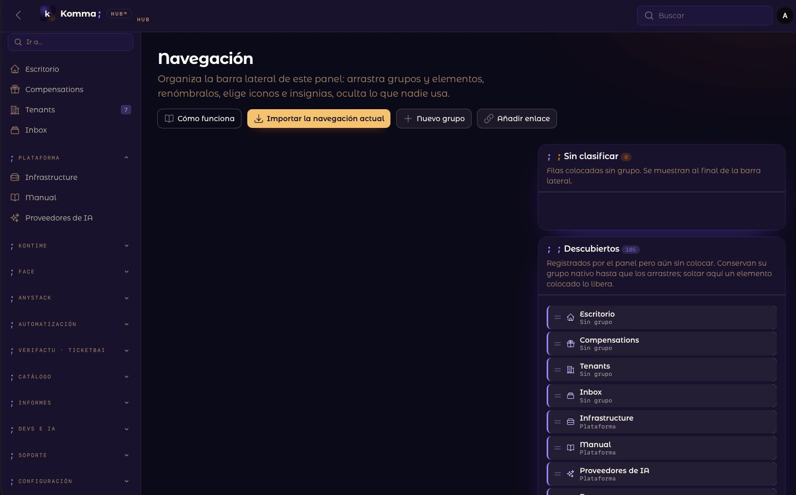

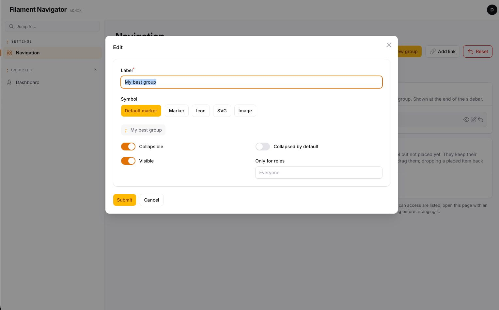

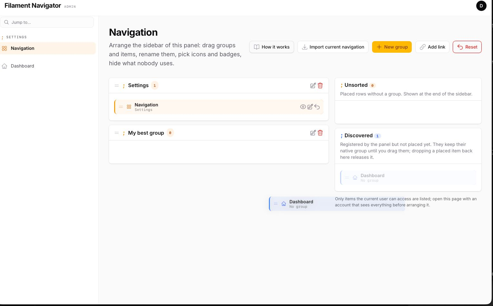

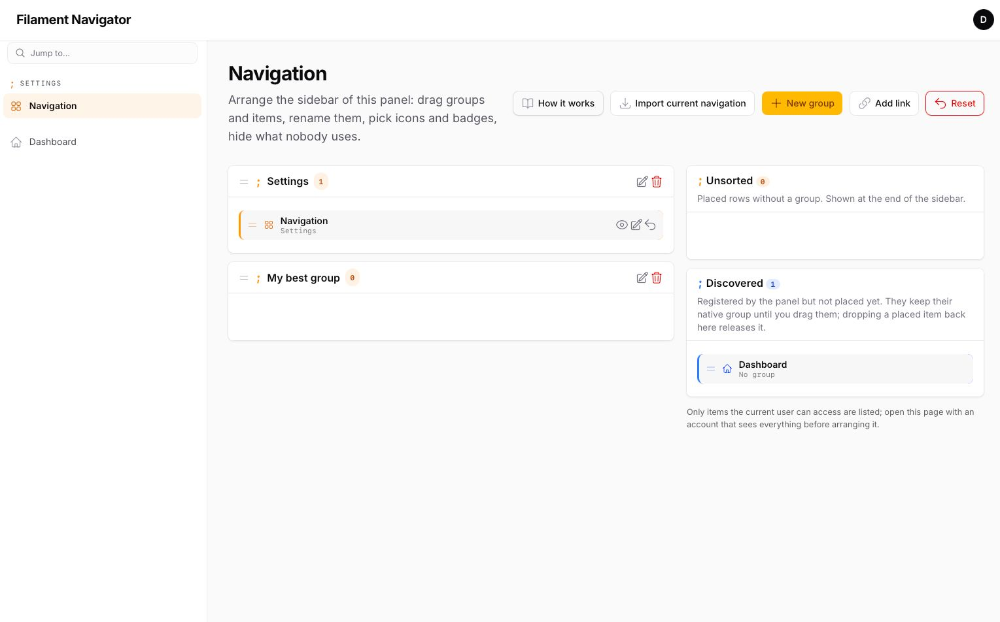

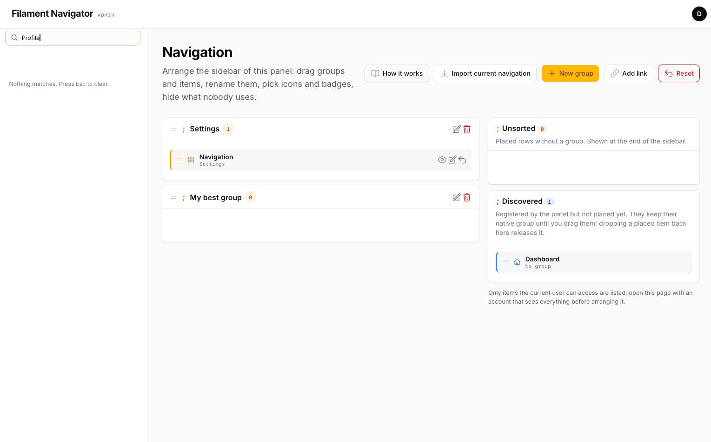


## Requirements

- PHP >= 8.4
- Laravel >= 13.0
- Filament >= 5.7

## Installation

This is a commercial package distributed through
[Anystack](https://anystack.sh) — it is not on public Packagist. Your
license key is what authenticates the download.

**1. Add the private repository** to your project's `composer.json`:

```json
{
    "repositories": [
        {
            "type": "composer",
            "url": "https://filament-navigator.composer.sh"
        }
    ]
}
```

**2. Require the package:**

```bash
composer require komma-softhouse/filament-navigator
```

Composer will prompt for authentication against
`filament-navigator.composer.sh`:

- **Username**: the email address your license is registered to.
- **Password**: your license key. If your license policy requires a
  fingerprint, append it to the key separated by a colon —
  `your-license-key:your-domain.com` — using the fingerprint you entered
  when activating the license.

Answer yes when Composer offers to store the credentials (they go in
`auth.json` — add that file to `.gitignore`). For CI, configure the same
credentials as http-basic auth from your secrets instead:

```bash
composer config http-basic.filament-navigator.composer.sh your@email.com YOUR-LICENSE-KEY
```

**3. Migrate and publish the assets:**

```bash
php artisan migrate
php artisan filament:assets
```

The migrations are loaded from the package; publish them, or the config
file, only if you need to edit them:

```bash
php artisan vendor:publish --tag=filament-navigator-migrations
php artisan vendor:publish --tag=filament-navigator-config
```

**4. Register the plugin** on your panel provider:

```php
use Komma\Navigator\NavigatorPlugin;

public function panel(Panel $panel): Panel
{
    return $panel
        // ...
        ->plugin(
            NavigatorPlugin::make()
                ->topbar()
                ->settingsPage()
                ->quickFilter()
                ->groupMarker(';')
                ->brandTagline('Admin')
                ->badges([
                    'tenants' => fn (): int => Tenant::query()->count(),
                ])
                ->authorizeSettingsUsing(fn (): bool => auth()->user()->hasRole('super-admin')),
        );
}
```

**5. Import the navigation.** Open the settings page
(`/{panel}/navigator`) and press **Import current navigation**, or run:

```bash
php artisan navigator:snapshot admin
```

Until you do, the sidebar shows exactly the tree Filament builds — the
plugin changes the look, not the structure.

## Configuration

The sidebar replacement is always on. Everything else ships disabled.

| Method | Getter | Default | Config key | What it does |
| --- | --- | --- | --- | --- |
| `->topbar(bool $condition = true)` | `hasTopbar()` | `false` | `topbar` | Replaces the panel topbar with the plugin's (brand block with tagline, sidebar controls, global search, notifications, user menu). Top navigation mode is not supported by the replacement topbar. |
| `->settingsPage(bool $condition = true)` | `hasSettingsPage()` | `false` | `settings_page` | Registers the **Navigation** page in the panel (slug `navigator`, group *Settings*). |
| `->quickFilter(bool $condition = true)` | `hasQuickFilter()` | `false` | `quick_filter` | Type-to-filter box at the top of the sidebar; filters the rendered items client-side, `Esc` clears. |
| `->brandTagline(string \| Closure \| null $tagline)` | `getBrandTagline()` | `null` | `brand_tagline` | Short monospace line under the logo, in the sidebar header and in the replacement topbar. |
| `->groupMarker(?string $marker)` | `getGroupMarker()` | `''` | `group_marker` | Monospace character printed before every group label instead of an icon (`;`, `→`, `//`). |
| `->unsortedLabel(?string $label)` | `getUnsortedLabel()` | `'Unsorted'` | `unsorted_label` | Label of the trailing group that holds placed rows without a group. Passed through `__()`. |
| `->badges(array $resolvers)` | `getBadges()` | `[]` | — | Named closures. An item configured with one of these keys shows the returned value as its badge; `null` or `''` hides it. Resolved once per request; a throwing resolver hides the badge. |
| `->authorizeSettingsUsing(?Closure $callback)` | `canManageSettings()` | any authenticated user | — | Who may open the settings page. |
| `->iconsDisk(?string $disk)` | `getIconsDisk()` | `'public'` | `icons.disk` | Filesystem disk for image symbols uploaded from the settings page. Must be publicly reachable. |
| `->iconsDirectory(?string $directory)` | `getIconsDirectory()` | `'navigator'` | `icons.directory` | Directory on that disk. |

Config file (`config/filament-navigator.php`):

| Key | Default | What it does |
| --- | --- | --- |
| `connection` | `null` | Database connection of the navigator tables (models and migration). |
| `tables.groups` / `tables.items` | `navigator_groups` / `navigator_items` | Table names. Change before the first migration. |
| `cache_ttl` | `3600` | Seconds the composed configuration of a panel stays cached. Every write flushes it; `0` disables the cache. |
| `unsorted_label`, `topbar`, `settings_page`, `quick_filter`, `brand_tagline`, `group_marker` | see above | Defaults for the fluent options. Environment variables: `FILAMENT_NAVIGATOR_CONNECTION`, `FILAMENT_NAVIGATOR_CACHE_TTL`, `FILAMENT_NAVIGATOR_TOPBAR`, `FILAMENT_NAVIGATOR_SETTINGS_PAGE`, `FILAMENT_NAVIGATOR_QUICK_FILTER`, `FILAMENT_NAVIGATOR_BRAND_TAGLINE`, `FILAMENT_NAVIGATOR_GROUP_MARKER`. |
| `icons.disk` / `icons.directory` | `public` / `navigator` | Where uploaded image symbols are stored. Environment variables: `FILAMENT_NAVIGATOR_ICONS_DISK`, `FILAMENT_NAVIGATOR_ICONS_DIRECTORY`. |

## The settings page

A **How it works** header action opens a slide-over with the flow and the meaning of every row action; it opens by itself the first time, while the panel has no configuration. Two columns. On the left, the configured groups with their items; on the right, the **Unsorted** bucket and the **Discovered** list (items the panel registers that have no row yet). Everything is drag and drop, between lists included:

- drag a discovered item into a group to place it;
- drag a placed item back to *Discovered* to release it (custom links cannot be released, only deleted);
- drag groups to reorder them.

Header actions: **Import current navigation** (imports every native group and item as rows, keeping existing rows), **New group**, **Add link** (a custom URL, optionally in a new tab), **Reset** (deletes the panel's configuration; the sidebar returns to what Filament builds).

Per group: edit (label, symbol, collapsible, collapsed by default, visible, roles) and delete (its items move to Unsorted). Per item: hide/show, edit (label, symbol, URL, badge, roles, new tab, visible — empty fields keep what the page or resource declares) and release/delete.

### Custom links

**Add link** creates a navigation item that no page or resource declares.
It takes a label, a URL — a path of the application (`/admin/reports`) or a
full address (`https://status.example.com`) —, a symbol, the group it goes
in (or *Unsorted*) and whether it opens in a new tab. From then on it is a
row like any other: drag it, edit it, give it a badge, restrict it to
roles, hide it. It is highlighted as active while the current URL is its
own. A custom link cannot be released, because there is no code to give it
back to; it is deleted.

A registered page or resource accepts a URL too: filled in, the item keeps
its place, access rules and active state and points somewhere else.

### Symbols: markers, icons, SVG, images

Every group and item — custom links included — has a **Symbol**, picked in its create or edit modal with a live preview of how the row will look. An icon name the application does not have is flagged in the preview and cannot be saved; one that stops existing later (an icon package removed) is ignored at render time, so a row never breaks the panel:

| Choice | Groups | Items | Stored as |
| --- | --- | --- | --- |
| Default | the plugin's `groupMarker()` (or the native icon if the group has one) | what the page or resource declares | `NULL` |
| Marker | any short text up to 16 characters (`;`, `→`, `$`, `//`), monospace, in the accent colour | — | `marker` column |
| Icon | a Blade icon name available in the app (`heroicon-o-home`, `phosphor-…`) | same | `icon` column |
| SVG | pasted markup, sanitised (scripts, event handlers, foreign objects and external references removed; sized by CSS; `fill="currentColor"` unless the drawing brings its own colours) | same | `icon` column, `<svg…` |
| Image | PNG, JPG, WebP, GIF, AVIF or an SVG file up to 512 KB, uploaded to the icons disk and rendered as `` at icon size | same | `icon` column, path on the disk |

Rendering precedence for a group: its marker → its icon → the plugin's global marker.

Images keep their own colours in light and dark mode and do not react to the active state — good for product logos, SVG is better for menu icons. Uploads go to `->iconsDisk('public')` / `->iconsDirectory('navigator')` (config `icons.disk` / `icons.directory`); the disk must be publicly reachable.

Only items the current user can access are listed, because discovery reads the navigation Filament composed for that user: arrange the panel with an account that sees everything.

Roles are stored as an array of names and checked with `hasAnyRole()` on the panel's user model when that method exists (spatie/laravel-permission). Without it, role restrictions are ignored.

## How the composition works

1. `$panel->getNavigation()` — Filament's own tree for the current user.
2. Configured groups, in their order, with the rows placed in them. Rows whose key is not registered any more are skipped.
3. Rows without a group → the *Unsorted* group.
4. Registered items without a row → appended under their native group label, in native order.

With no rows at all for the panel the native tree is returned untouched, so installing the plugin changes the look but not the structure until you arrange it.

Item keys are what Filament assigns: the resource or page class for discovered items, the label for hand-made `NavigationItem` instances, `custom:{slug}-{random}` for links created from the page. Renaming a class orphans its row (it is skipped, never shown broken); release it from the page and place the item again.

## Artisan commands

```bash
php artisan navigator:snapshot {panel} [--fresh]   # import the native navigation (--fresh deletes the current rows first)
php artisan navigator:reset {panel} [--force]      # delete the configuration of a panel
```

The snapshot command runs without an authenticated user: pages and resources that gate navigation on the user register nothing there. Use the page action when that matters.

## Theming

The stylesheet reads these custom properties (defaults shown for light mode; `.dark` redefines the colours). Override them in the panel theme:

```css
:root {
    --kn-bg: #ffffff;
    --kn-bg-elevated: color-mix(in srgb, var(--gray-50) 70%, #ffffff);
    --kn-fg: var(--gray-700);
    --kn-fg-strong: var(--gray-950);
    --kn-fg-muted: var(--gray-500);
    --kn-line: color-mix(in srgb, var(--gray-950) 8%, transparent);
    --kn-accent: var(--primary-600);
    --kn-accent-soft: color-mix(in srgb, var(--primary-500) 10%, transparent);
    --kn-hover: color-mix(in srgb, var(--gray-950) 5%, transparent);
    --kn-active-bg: color-mix(in srgb, var(--primary-500) 12%, transparent);
    --kn-active-fg: var(--gray-950);
    --kn-icon: var(--gray-400);
    --kn-icon-active: var(--primary-600);
    --kn-badge-bg: color-mix(in srgb, var(--primary-500) 16%, transparent);
    --kn-badge-fg: var(--primary-700);

    --kn-font: var(--font-family);
    --kn-mono: var(--mono-font-family);
    --kn-radius: 0.55rem;
    --kn-item-height: 2.35rem;
    --kn-group-gap: 1.1rem;
    --kn-label-size: 0.875rem;
    --kn-group-size: 0.66rem;
    --kn-group-tracking: 0.14em;
    --kn-marker-size: 0.9rem;
    --kn-pad-x: 0.9rem;
}
```

Class hooks, for anything the tokens do not cover: `.kn-sidebar`, `.kn-header`, `.kn-brand`, `.kn-brand-tagline`, `.kn-filter`, `.kn-nav`, `.kn-group`, `.kn-group-head`, `.kn-group-marker`, `.kn-group-label`, `.kn-item`, `.kn-item-link`, `.kn-item-icon`, `.kn-item-label`, `.kn-item-badge-ctn`, `.kn-footer`, `.kn-topbar`, `.kn-topbar-brand`, `.kn-topbar-end`. Active states: `.kn-item-active`, `.kn-item-parent-active`, `.kn-group-active`, `.kn-collapsed`.

All render hooks of the stock sidebar and topbar (`SIDEBAR_START`, `SIDEBAR_LOGO_BEFORE/AFTER`, `SIDEBAR_NAV_START/END`, `SIDEBAR_FOOTER`, `TOPBAR_START/END`, `TOPBAR_LOGO_BEFORE/AFTER`, `GLOBAL_SEARCH_BEFORE/AFTER`) are honoured in the same positions.

## Dark mode and translations

Every surface the plugin renders — sidebar, topbar, settings page and the
help slide-over — follows Filament's own light/dark toggle with no
configuration; `.dark` redefines the `--kn-*` colour tokens.

Strings are English literals wrapped in `__()`; a Spanish translation
ships in `resources/lang/es.json`, and the keys resolve against your own
application's `lang/{locale}.json` too. Publish to add a language:

```bash
php artisan vendor:publish --tag=filament-navigator-translations
```

## Testing

```bash
composer test
```

## Changelog

Please see [CHANGELOG](https://github.com/komma-softhouse/filament-navigator-docs/blob/main/CHANGELOG.md) for more information on
what has changed recently.

## Support and community

The plugin's source is private. Everything public lives in the docs
repository:

- **[Documentation](https://github.com/komma-softhouse/filament-navigator-docs)** — this README.
- **[Issues](https://github.com/komma-softhouse/filament-navigator-docs/issues)** — bugs and feature requests.
- **[Discussions](https://github.com/komma-softhouse/filament-navigator-docs/discussions)** — questions, integration help, show and tell.

## Security Vulnerabilities

Never in a public issue or discussion. Please review
[our security policy](https://github.com/komma-softhouse/filament-navigator-docs/blob/main/SECURITY.md) — a private advisory on
the docs repository, or **security@kommasofthouse.com**.

## Credits

- [Elias Olivtradet](https://github.com/edeoliv)
- [Komma SoftHouse](https://github.com/komma-softhouse)

## License

This is commercial software. Please see [License File](https://github.com/komma-softhouse/filament-navigator-docs/blob/main/LICENSE.md)
for the full terms.